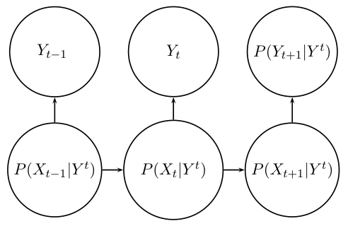
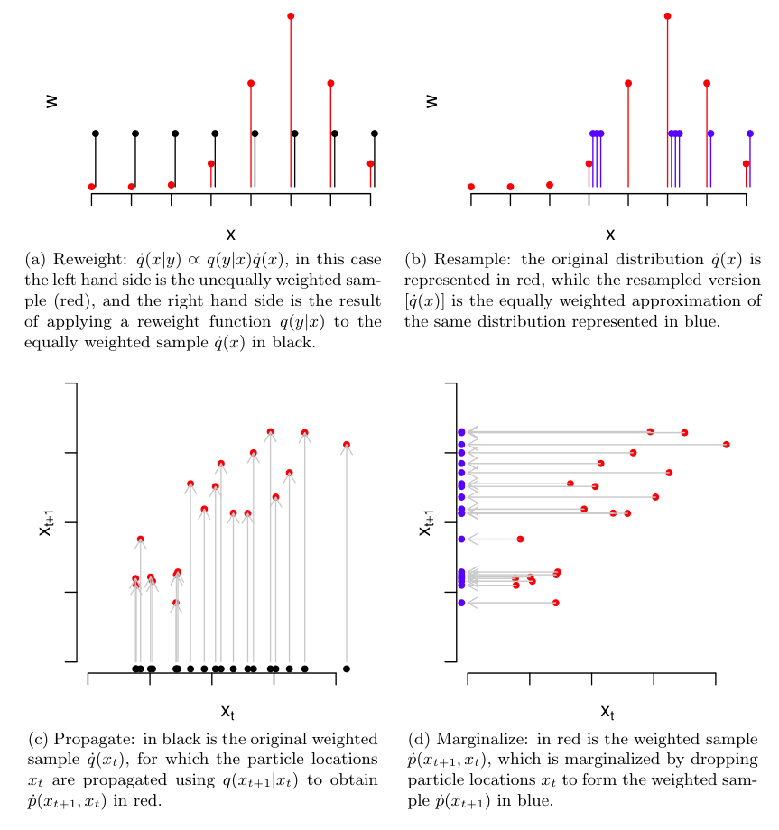

# smrf_models

This is a reimplmentation of my MS project at UCSC (2011) using PyTorch.

The project focuses on three aspects.
* A grammar for feed forward Sequential Monte Carlo algorithms (aka Particle Filters)
* A new O(n log(n) ) algorithm for SMC backward smoothing
    * Previously O(n2), but with the new restrictions of being univariate with no static parameters
* A method for converting a regular Markov Random Field into a univariate SMC problem using FF and BS.

At the time of the original project (2009) the goal was to utilize GPUs for SMC, however the existing o(n2) algorithm for Backwarod Smoothing needed to be addressed first.

Sequential Monte Carlo is a statistical method for numerical integration using weighted samples and is often used in time series or state space models.

Markov Random Fields in this context is like a grid of variables (think a pixel in a picture) that is only related to its local neighbors, where the dimension of the MRF is the number of variables or pixels.

MS Project: [Boost Smoothing and SMRF Models (2011)](Boost_Smoothing_and_SMRF_Models.pdf)

Jacob Colvin
